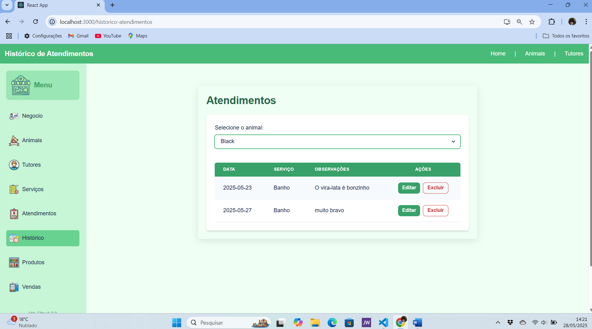

# Vet_Clin - Sistema de Gestão para Clínicas Veterinárias
# Acesse a versão atual do projeto em: https://github.com/Masterluke99/vet_clin

**Versão atual: 1.0.0**

Um sistema completo de gestão para clínicas veterinárias desenvolvido em React com TypeScript e integração com Firebase.

## Sobre o Projeto

Vet_Clin é uma aplicação web que permite gerenciar todos os aspectos de uma clínica veterinária, incluindo:

- Cadastro de animais e seus tutores
- Agendamento e registro de atendimentos
- Histórico médico dos pacientes
- Controle de produtos e estoque
- Registro de vendas
- Cadastro de serviços
- Gestão de funcionários

Este projeto foi criado com [Create React App](https://github.com/facebook/create-react-app).

## Capturas de Tela

Abaixo estão capturas de tela das principais funcionalidades do sistema:

### Painel de Gestão


### Cadastro de Animais


### Cadastro de Tutores


### Registro de Serviços


### Atendimentos



## Configura��o do Banco de Dados (Firebase)

O gerenciamento dos dados � feito pelo Firebase. Para configurar o projeto, siga os passos abaixo:

1. Crie uma conta no [Firebase](https://firebase.google.com/) se ainda n�o tiver
2. Acesse o [Console do Firebase](https://console.firebase.google.com/) e crie um novo projeto
3. No projeto criado, ative o servi�o Firestore Database em "Build > Firestore Database"
4. Ative tamb�m o servi�o Authentication em "Build > Authentication" se necess�rio
5. V� para "Project Settings" (configura��es do projeto) clicando na engrenagem
6. Em "Your apps", adicione um aplicativo da web (</> Web)
7. Registre seu aplicativo com um nome e copie as credenciais fornecidas
8. No projeto Vet_Clin, atualize o arquivo `src/firebaseConfig.ts` com as credenciais copiadas:

```typescript
// Substitua pelos dados do seu projeto Firebase
const firebaseConfig = {
  apiKey: "SUA_API_KEY",
  authDomain: "seu-projeto.firebaseapp.com",
  projectId: "seu-projeto",
  storageBucket: "seu-projeto.appspot.com",
  messagingSenderId: "123456789",
  appId: "1:123456789:web:abcdef123456",
  measurementId: "G-XXXXXXXXXX" // opcional
};

const app = initializeApp(firebaseConfig);
const database = getDatabase(app);
const db = getFirestore(app);

export { db, database };
```

Ap�s a configura��o, o aplicativo criar� e gerenciar� os dados automaticamente, sem necessidade de criar tabelas manualmente.

Certifique-se de que as depend�ncias do Firebase est�o instaladas executando:

```bash
npm install firebase
```

## Tecnologias Utilizadas

- React
- TypeScript
- Firebase (Firestore)
- Chakra UI

## Comandos Dispon�veis

Na pasta do projeto execute o comando:

### `npm start`

O app ser� executado no modo desenvolvedor.  
Abra [http://localhost:3000](http://localhost:3000) no navegador.

A p�gina ser� recarregada automaticamente quando voc� fizer altera��es no c�digo.

### `npm test`

Inicia o executor de testes no modo interativo de observa��o.  
Veja mais sobre [execu��o de testes](https://facebook.github.io/create-react-app/docs/running-tests) para mais informa��es.

### `npm run build`

Compila o aplicativo para produ��o na pasta `build`.  
Empacota corretamente o React no modo de produ��o e otimiza a compila��o para o melhor desempenho.

A compila��o � minificada e os nomes dos arquivos incluem hashes.  
Seu aplicativo est� pronto para ser implantado!

## Saiba Mais

Voc� pode aprender mais na [documenta��o do Create React App](https://facebook.github.io/create-react-app/docs/getting-started).

Para aprender React, consulte a [documenta��o do React](https://reactjs.org/).
